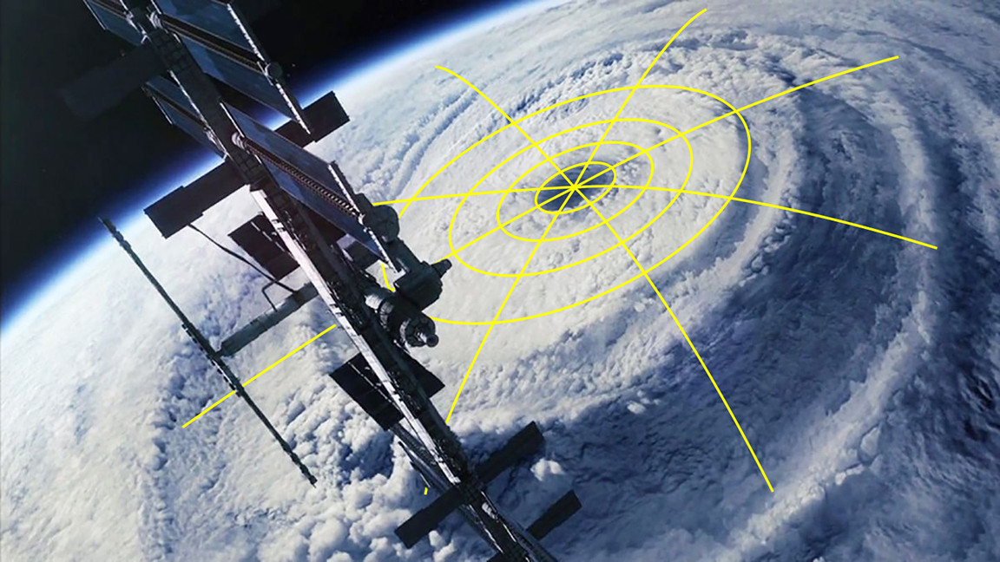
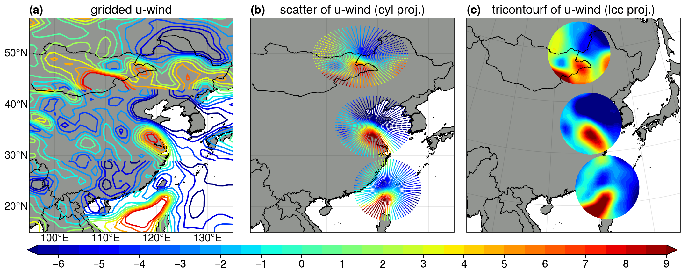
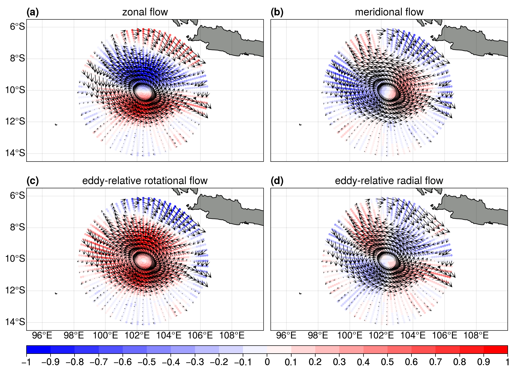

# xvortices



## 1. Introduction
`xvortices` is a python package built on [`xarray`](http://xarray.pydata.org/en/stable/) (starts with an `x`), targeting at extracting information about moving vortices from lat/lon gridded datasets.  Moving vortices include [tornado](https://en.wikipedia.org/wiki/Tornado), [tropical cyclone](https://en.wikipedia.org/wiki/Tropical_cyclone), [extratropical cyclone](https://en.wikipedia.org/wiki/Extratropical_cyclone), [polar vortex](https://en.wikipedia.org/wiki/Polar_vortex) in the atmospheric context, as well as [mesoscale eddy](https://en.wikipedia.org/wiki/Eddy_(fluid_dynamics)) and [ocean gyre](https://en.wikipedia.org/wiki/Ocean_gyre) in the oceanic context.  These moving vortices are usually described in a moving (also known as quasi-Lagrangian) cylindrical coordinate.  As the coordinate system moves on the spherical earth as a whole, one could take a view of the vortex dynamics from a quasi-Lagrangian perspective instead of the traditional Eulerian perspective.

Basically, this package would do the following jobs:
- accept an `xarray.Dataset` (or a list of `xarray.DataArray`) as an input dataset, usually in a fashion of lat/lon grid;
- interpolate the data onto the cylindrical coordinates once the origin of the moving coordinate is given (this is naturally done using the builtin function of `xarray`);
- return the interpolated fields, including scalars and vectors;
- re-project the vectors onto the azimuthal/radial directions;

With this tool, one can perform quasi-Lagrangian diagnoses of the structure, evolution, budget, intensity etc in a perspective different from the Eulerian one.

---

## 2. How to install
**Requirements**
`xvortices` is developed under the environment with `numpy` (=version 1.15.4), and `xarray` (=version 0.15.1).  Older versions of these packages are not well tested.


**Install from github**
```
git clone https://github.com/miniufo/xvortices.git
```

---

## 3. Examples
### 3.1 A moving tropical cyclone
Here we demonstrate an application to the case of a moving tropical cyclone (TC) over the western North Pacific.  One may need [`besttracks`](https://github.com/miniufo/besttracks) to load TC best-track data and cooperate with `xvortices`:
```python
import xarray as xr
from xvortices.xvortices import load_cylind, project_to_cylind

azimNum, radiNum, radMax = 72, 31, 6

# variables inside are [u, v, w, h]
dset = xr.open_dataset('gridded.nc')

# one can obtain tropical cyclone (TC) best-track
# data from the `besttracks` package
olon  = TC.get_as_xarray('lon') # timeseries of center longitudes
olat  = TC.get_as_xarray('lat') # timeseries of center latitudes
uovel = TC.get_as_xarray('uo')  # timeseries of center u-vel
vovel = TC.get_as_xarray('vo')  # timeseries of center v-vel

[u, v, w, h], lons, lats, etas = load_cylind(dset, olon=olon, olat=olat,
                                             azimNum=azimNum, radiNum=radiNum,
                                             radMax=radMax)
urel = u - uovel # storm-relative u
vrel = v - vorel # storm-relative v

# storm-relative azimuthal/radial winds
uaz, vra = project_to_cylind(urel, vrel, etas)
```

More details can be found at this [TC notebook](./notebooks/1.TCExample.ipynb).



---

### 3.2 A moving mesoscale eddy
This is a mesoscale eddy case over the southern Indian Ocean.
```python
import pandas as pd
import xarray as xr
from xvortices.xvortices import load_cylind, project_to_cylind

# load an eddy positions from the "Mesoscale Eddy Trajectory Atlas" product
eddy = pd.read_csv('d:/SETIO2021.txt', sep='\s+', index_col='time', parse_dates=True)
# load AVISO gridded sea level anomaly and associated flow
dset = xr.open_dataset('D:/dataset-duacs-nrt-global-merged-allsat-phy-l4_SETIO_Eddy.nc')

# parameters of the cylindrical coordinates
azimNum, radiNum, radMax = 72, 31, 3

# interpolate from lat/lon grid to cylindrical grid
azimNum, radiNum, radMax = 72, 31, 4
[sla, adt, ugos, vgos], lons, lats, etas = load_cylind(dset[['sla','adt','ugos','vgos']],
                                             olon=eddy.lons.to_xarray(),
                                             olat=eddy.lats.to_xarray(),
                                             azimNum=azimNum, radiNum=radiNum,
                                             radMax=radMax,
                                             lonname='longitude',
                                             latname='latitude')

# calculate eddy's translating speed
uo = (eddy['lons'].diff()/86400*np.cos(np.deg2rad(eddy['lats']))).to_xarray()
vo = (eddy['lats'].diff()/86400).to_xarray()

# calculate eddy-relative current components
u_r = ugos - uo
v_r = vgos - vo

# project u/v to azimuthal/radial components
uaz, vra = project_to_cylind(u_r, v_r, etas)
```

More details can be found at this [notebook](./notebooks/2.EddyExample.ipynb).


